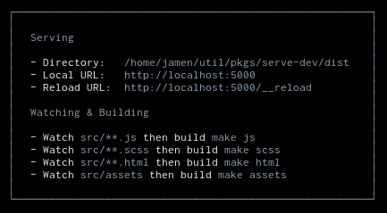

# serve-dev

ZEIT's [serve](https://github.com/zeit/serve) made with auto-reloading and GNU Make rebuilding.



## Install

```
npm i @jamen/serve-dev
```

## Usage

### `serve-dev [public] [options]`

Starts a static file serve with optional rebuilding and auto-reloading.

The available options are:

- `--listen <listen_uri>` Specifies where the server listens from. Its the same as `serve`.
- `--config <path>` Loads a JSON file of `serve-handler` options.
- `--watch <pattern>` A file, directory, or glob pattern where the server watches files.
- `--make <target>` A make target that corrosponds to a watcher.
- `--https` Enables HTTPS. Uses `--key` and `--cert`.
- `--program <name>` Use something other than `make` for building.
- `--reload <path>` The server endpoint where reload events are pushed.

### Auto-reloading

In order for auto-reloading to work, your application needs to support it. This is demonstrated in the code below.

```js
let src

(function connect (reconnect) {
    src = new EventSource('/__reload')
    src.onopen = () => reconnect && window.location.reload()
    src.onmessage = () => window.location.reload()
    src.onerror = () => setTimeout(() => connect(true), 3000)
})()

window.addEventListener('beforeunload', () => {
    if (src && src.readyState < 2) {
        src.close()
    }
})
```

[A bug](https://bugzilla.mozilla.org/show_bug.cgi?id=833462) with Firefox makes the `beforeunload` event listener necessary.